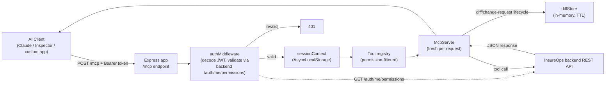

# SPEC: mcp-commission-sync

Status: **Production-readiness pass complete** (v0.3.0) | Owner: TBD | Last updated: 2026-07-23

## 0. Revision note

v0.1.0 was built against an assumed generic backend contract (RS256/JWKS auth, a flat
"commission rule" model, a backend-side diff endpoint) before any real backend was
available. Once real dev-tenant credentials for `devapp.insureops.io` were provided,
live exploration of that backend (its real login response, JWT payload, and OpenAPI
spec at `/api/docs-json`) revealed three material differences from those assumptions.
This revision documents what changed and why. See Section 11 for the full list.

## 1. Purpose

`mcp-commission-sync` is a remote MCP (Model Context Protocol) server that lets an AI
agent reconcile insurer commission-schedule updates against InsureOps's own backend -
via that backend's REST API, never a database directly. It exists to support one
workflow, safely, where real money (commission payouts) is on the line.

## 2. Workflow this server supports

1. An insurer issues new/updated commission terms (a circular, rate card, email, PDF).
2. A broker-side user pastes/uploads that content into an AI chat.
3. The AI extracts it into a structured `CommissionScheduleInput` and calls this server
   to:
   - Fetch the commission schedule(s) **currently stored in the application**
     (`list_commission_schedules` / `get_commission_schedule`).
   - Discover valid rule-criteria and rate-basis values for the relevant line of
     business (`list_schedule_dimensions`, `list_schedule_basis_types`).
   - Get a diff (added / removed / changed) computed by this MCP server itself,
     comparing the current active version against the proposal
     (`diff_commission_schedule_change`).
   - Show the user exactly what will change.
4. Only on explicit user confirmation does the AI call a **write** tool
   (`create_change_request`, then `apply_change_request`), which the backend
   persists as a new/updated schedule (and, if requested, a specific version
   activation).

Two decisions matter most, because commission math has real financial impact:

- **The diff is computed server-side (by this MCP server), never "trusted" from the
  LLM's reading of a document.** The LLM proposes structured data; a fresh GET of the
  currently-active schedule is the source of truth for the comparison. (This deviates
  from the original "the backend computes the diff" principle - see Section 11, item 2 -
  because the real backend has no diff/compare endpoint of its own.)
- **No schedule change is ever applied on the first tool call.** Proposing
  (`diff_commission_schedule_change` -> `create_change_request`) and applying
  (`apply_change_request`) are two separate, separately-authorized tool calls. The apply
  step requires the referenced change request to still be `PENDING_CONFIRMATION`
  (protects against a stale/raced comparison, or double-apply).

## 3. Core architectural requirements

| # | Requirement | Where it's implemented |
|---|---|---|
| 1 | **Zero Tenant Parameter Rule** - `tenantId`, `accessToken`, permissions are never fields in a tool's Zod schema. | Every `inputSchema` in `src/server/tools/*.ts`; enforced by convention + code review, not a runtime check. |
| 2 | **Transport-level auth capture** - validate the inbound token on every request; store `tenantId`/`userId`/`roles`/`permissions`/`accessToken` in `AsyncLocalStorage` for that request's lifetime. | `src/auth/middleware.ts` (`authMiddleware`), `src/auth/context.ts` (`sessionContext`). |
| 3 | **Dynamic tool filtering** - `tools/list` returns only tools the caller's live permissions allow. | `src/server/tools/registry.ts` (`getToolsForSession`) + `buildServerForSession` in `src/server/index.ts`, which registers only the allowed tools on a fresh `McpServer` per request. |
| 4 | **Double-layer execution guard** - re-check permissions *and* tenant ownership inside every write handler, even though the tool was already filtered from the list. | `assertPermission` / `assertPermissionAndTenant` in `src/server/tools/registry.ts`, called at the top of every write handler. |
| 5 | **Remote API proxying only** - no DB driver, no ORM, no connection string. | `src/backend/client.ts`; verify via `package.json` having zero DB dependencies. |
| 6 | **Compute-then-confirm for writes** - diffing is side-effect-free; applying is separate, explicit, permission-gated. | `diff_commission_schedule_change` vs. `apply_change_request` in `src/server/tools/write.ts`. |
| 7 | **Idempotency & audit** - every staged change carries `sourceReference`; `apply_change_request` requires literal `confirm: true`. | `sourceReference` field on `create_change_request`; `z.literal(true)` on `apply_change_request`/`activate_schedule_version`/`deactivate_commission_schedule`. |

## 4. Architecture

Each request builds a **fresh** `McpServer` instance (stateless Streamable HTTP,
`sessionIdGenerator: undefined`) registering only the tools the caller's permissions
allow. There is no shared, long-lived server whose visible tool set could leak across
concurrently-connected sessions with different permissions. The one deliberate
exception to full statelessness is `diffStore.ts` (Section 11, item 2) - see its
in-file caveat about horizontal scaling.

## 5. Data model

Defined in [`src/types/commissionSchedule.ts`](src/types/commissionSchedule.ts), based
on the real backend's `/commission-schedules` contract (confirmed via its OpenAPI spec
and live GET responses against `devapp.insureops.io`):

- **`CommissionScheduleInput`** - the shape the LLM must normalize an insurer's document
  into, matching the backend's own POST/PUT body: `insurerIds[]`, `productId`,
  `planIds[]?`, `addonDefinitionIds[]?`, `countryId?`, `lobProfile`, `name`, `code?`,
  `priority?`, `effectiveFrom`, `effectiveTo?`, `isActive?`, `dimensionValues[]` (the
  "rule criteria" - `{ dimensionCode, value }` or `{ dimensionCode, minNumericValue,
  maxNumericValue }`), `rateComponents[]` (the rate table - `{ componentType, basisType,
  rateType, rateValue, addonDefinitionId? }`), `matchConditions?`.
- **`CommissionScheduleRecord`** - a schedule as returned by the backend: scope fields
  plus `status`, `insurers[]`/`plans[]`/`addons[]` (each wrapping the related entity),
  and `versions[]` (each version carrying its own `effectiveFrom`/`effectiveTo`/
  `isActive`/`dimensionValues`/`rateComponents`).
- **`DiffResult`** - `{ diffId, mode, scheduleId?, scopeChanges[], dimensionValueChanges[],
  rateComponentChanges[], proposed, expiresAt }`. Computed by
  [`scheduleDiff.ts`](src/server/tools/scheduleDiff.ts), not the backend. `diffId` is
  short-lived (`DIFF_TTL_SECONDS`), held in [`diffStore.ts`](src/server/tools/diffStore.ts).
- **`ChangeRequest`** - `{ changeRequestId, diffId, mode, scheduleId?, status,
  sourceReference, notes?, createdAt, createdBy, tenantId }`. `status` is one of
  `PENDING_CONFIRMATION` | `APPLIED` | `REJECTED` | `EXPIRED`. Also held in `diffStore.ts`
  - the backend has no equivalent concept.

## 6. Tool catalog

| Tool | Required permission | Verb | Backend endpoint | Notes |
|---|---|---|---|---|
| `list_insurers` | `settings:insurer:view` | GET | `/insurers` | Tenant-scoped, paginated. |
| `list_products` | `settings:products:view` | GET | `/products` | Paginated. |
| `list_plans` | `settings:plans:view` | GET | `/plans?productId=` | Paginated. |
| `list_commission_schedules` | `commissions:schedules:view` | GET | `/commission-schedules` | Source of truth for comparison. |
| `get_commission_schedule` | `commissions:schedules:view` | GET | `/commission-schedules/{id}` | Full detail incl. version history. |
| `list_schedule_dimensions` | `commissions:schedules:view` | GET | `/commission-schedules/registry/dimensions` | Valid `dimensionCode` values. |
| `list_schedule_basis_types` | `commissions:schedules:view` | GET | `/commission-schedules/registry/basis-types?lobProfile=` | Valid `basisType` values, dynamic per LOB. |
| `list_change_requests` / `get_change_request` | `commissions:schedules:view` | - | (in-memory, see Section 11) | |
| `diff_commission_schedule_change` | `commissions:schedules:create` or `:update` | GET (read) | `/commission-schedules/{scheduleId}` | Side-effect-free. Returns `diffId`. |
| `create_change_request` | `commissions:schedules:create` or `:update` | - | (in-memory) | Bundles a diff into a `PENDING_CONFIRMATION` request. |
| `apply_change_request` | `commissions:schedules:create` or `:update` (checked against the request's actual mode) | POST or PUT | `/commission-schedules` or `/commission-schedules/{id}` | Requires literal `confirm: true`. |
| `reject_change_request` | `commissions:schedules:create` or `:update` | - | (in-memory) | |
| `activate_schedule_version` | `commissions:schedules:update` | POST | `/commission-schedules/{id}/versions/{versionId}/activate` | Requires literal `confirm: true`. |
| `deactivate_commission_schedule` | `commissions:schedules:update` | PUT | `/commission-schedules/{id}` | Requires literal `confirm: true`. |

## 7. Auth model

- This backend issues its own tokens directly from `POST /auth/login`
  (email+password) - there is **no external IdP**. Tokens are **HS256**-signed (a
  shared secret this server does not hold) and carry **no `iss`/`aud` claims** - so
  neither JWKS-based signature verification nor RFC 8707 audience binding is possible
  here, unlike the original v0.1.0 design.
- `authMiddleware` decodes the token (without verifying its signature) for `sub` (->
  `userId`), `tenantId`, `roles`, `exp`, then calls the backend's own `GET
  /auth/me/permissions` with the same token as the actual validation step: a non-200
  response is treated as an invalid token; a 200 response's `data.keys` becomes the
  session's live `permissions`.
- Every actual write this server performs forwards the same token back to the backend,
  which independently re-validates it - so a forged/expired token can never result in an
  unauthorized write, only, at worst, an unhelpful `tools/list` until rejected here.
- On failure: `401 { error: "invalid_token", error_description }`. There is no RFC 9728
  Protected Resource Metadata document in this version - it would advertise an OAuth
  authorization server that doesn't exist for this backend.
- **Local-testing-only escape hatch**: `DISABLE_AUTH=true` skips verification entirely
  and injects a fixed dev session. Hard-refused at boot if `NODE_ENV=production`. See
  README "Local testing without real credentials".

## 8. Environment variables

| Variable | Required | Purpose |
|---|---|---|
| `MAIN_APP_API_URL` | Yes | Base URL of the backend REST API, including `/api/v1`. |
| `MAIN_APP_API_TIMEOUT_MS` | No (default 10000) | Outbound call timeout. |
| `DIFF_TTL_SECONDS` | No (default 900) | How long a `diffId`/change request stays valid in this server's own store. |
| `PORT` | No (default 3000) | Listen port. |
| `ALLOWED_ORIGINS` | No | CORS allow-list, comma-separated. |
| `NODE_ENV` | No (default development) | Standard service config. |
| `LOG_LEVEL` | No (default info) | Standard service config. |
| `DISABLE_AUTH` | No, testing only | Skips auth entirely; refused if `NODE_ENV=production`. |
| `DEV_TENANT_ID` / `DEV_USER_ID` / `DEV_ROLES` / `DEV_PERMISSIONS` / `DEV_ACCESS_TOKEN` | No, testing only | Fixed dev session values used only when `DISABLE_AUTH=true`. |

## 9. Explicit scope decisions

- **OpenAPI-driven tool generation is out of scope for this build.** All tools are
  hand-written against the real contract discovered at `devapp.insureops.io/api/docs-json`
  (Section 6), not auto-generated from it.
- **A single generic passthrough tool (`call_backend_api`) was explicitly rejected** as a
  design option - it would remove per-operation schema validation, the ability to hide
  write-shaped calls from read-only sessions, and the `diffId`/`confirm` guardrails
  entirely.
- **Diff/change-request state lives in this server's own local SQLite file, not the
  backend.** See Section 11, item 2, for why it's computed here at all, and the
  horizontal-scaling caveat in `src/server/tools/diffStore.ts` - persisted across
  restarts as of the production-readiness pass, but still single-instance.
- **Deliberately deferred, tracked for later** (production-readiness plan, "Explicitly
  out of scope"): full OAuth/refresh-token flow (brokers use a manually-refreshed
  bearer token from `/setup` for v1 - Section 6/11), maker-checker/dual-approval on
  `apply_change_request`, horizontal scaling (Redis/Postgres-backed store,
  multi-instance), rate-limit coverage beyond `diff_commission_schedule_change`, and
  retry/circuit-breaker resilience for backend flakiness.

## 10. Verification status

- [x] Typecheck + build clean.
- [x] Live-verified against the real dev backend using a real `POST /auth/login`-issued
      token: `GET /auth/me/permissions` validation succeeds, and reads succeed for
      `/insurers`, `/products`, `/plans`, `/commission-schedules`, and both registry
      endpoints.
- [x] `apply_change_request`'s POST (create) and PUT (update) paths were both fired
      against a disposable test schedule on the dev tenant
      (`insurerId=cmr4fl4fu02e59urb0baiulk3` "NEW INSURER" /
      `productId=cmr4fcmuu02e29urba8zkorn8` "NEWTATA", a non-system-defined test
      product picked specifically so no real/shared data was touched), then deleted.
      Confirmed: POST creates version 1 active; PUT creates a new version active and
      deactivates the prior one (never edits a version in place); the returned record
      matched the diff shown beforehand in both cases. This run surfaced one real
      contract gap - see Section 11, item 6.
- [x] `activate_schedule_version` live-tested against the same disposable schedule -
      rolling back to the older (by-then-inactive) version correctly flipped
      `isActive` on both versions.
- [x] `deactivate_commission_schedule` live-tested and found broken as originally
      implemented (PUT-based) - fixed and re-verified; see Section 11, item 6.
- [x] Automated test suite (vitest) added: diff logic, permission-filtering negative
      case, and a mocked write-flow including the stale-diff guard and double-apply
      guard - `npm test`, 23/23 passing as of this verification pass.
- [x] Change-request/audit trail moved from an in-process `Map` to a local SQLite file
      (`DB_PATH`, `src/server/tools/db.ts` / `diffStore.ts`) - survives a restart;
      smoke-tested directly (save/take a diff, create/fetch/list/update-status a change
      request, including tenant-isolation and re-take-after-consume checks).
- [x] Stale-diff guard added: `DiffResult.baselineFingerprint` (hash of the active
      version's identity + `dimensionValues`/`rateComponents`) is captured at diff time
      and re-checked in `apply_change_request` for `mode='update_existing_schedule'`
      before writing; covered by both a unit test and, implicitly, by every live update
      test above (each succeeded specifically because the fingerprint still matched).
- [x] `/setup` self-service page added and live-tested end-to-end against the real
      backend: a real email/password produces a working MCP config snippet with a real
      bearer token; a wrong password renders a clear error instead of a stack trace or
      a silent failure.
- [~] **Hosting**: this server has still only run on localhost/loopback ports in this
      environment - no cloud/VM credentials were available to this agent to actually
      provision a persistent, HTTPS-reachable host. What *is* done: a `Dockerfile`
      (multi-stage, `node:20-slim` for prebuilt `better-sqlite3` binaries) and
      `docker-compose.yml` (named volume for `DB_PATH`, no TLS termination baked in -
      expects a reverse proxy in front) - neither has been build-tested here (no local
      Docker daemon available either). **This remains an open decision for whoever owns
      infra** - see README "Deployment notes".
- [ ] **No broker has yet done a live end-to-end smoke test with a genuinely
      restricted (non-`tenant_admin`) permission set.** The one real credential
      available throughout this project (`bheem123@yopmail.com`) carries `roles:
      ["tenant_admin"]` and 263 permissions - i.e. full access - so every live test
      above (including the write-path verification) ran as an effectively unrestricted
      user. The negative-permission case is unit-tested (Section 4/10, mocked session),
      but that only proves the filtering *logic* is correct, not that it matches the
      real backend's behavior for an actual restricted account. Needs a second test
      credential with a narrower role (e.g. a plain broker/agent, not admin) to close.

## 11. What changed from the original (v0.1.0) design, and why

Real dev-tenant credentials for `devapp.insureops.io` were provided after the original
build. Live exploration (a real login call, decoding the returned JWT, and pulling the
backend's own OpenAPI spec from `/api/docs-json`) surfaced three material gaps between
the original assumptions and reality:

1. **Auth**: assumed RS256 + JWKS + `iss`/`aud` (RFC 8707/9728). Reality: HS256,
   backend-issued, no JWKS, no `iss`/`aud` claims at all. Resolved by validating tokens
   live against `GET /auth/me/permissions` instead of verifying signatures locally (see
   Section 7). This was an explicit user decision between three options (verify via that
   endpoint / decode-only and rely on the backend / obtain the shared HS256 secret) -
   verify-via-endpoint was chosen as it needs no secret-sharing and returns live,
   current permissions.
2. **No backend diff endpoint**: the original design required "the backend computes the
   diff, never trust the LLM's". The real backend has plain CRUD + a
   `versions/{id}/activate` endpoint, but nothing resembling a compare/diff operation.
   Resolved by computing the diff inside this MCP server itself (`scheduleDiff.ts`),
   against a fresh GET of the current schedule - also an explicit user decision, chosen
   over waiting for a backend-side diff endpoint to be built, or skipping structured
   diffing entirely.
3. **Domain model**: assumed a flat "commission rule" (`productCode` + open `criteria` +
   single `commissionType`/`commissionValue`). Reality is a versioned "commission
   schedule" (`ruleSet` internally) with a scope (`insurers[]`/`plans[]`/`productId`/
   `lobProfile`), and each version carrying its own `dimensionValues[]` (rule criteria,
   dynamic per plan) and `rateComponents[]` (a full rate table, not one flat rate).
   Resolved by rewriting `src/types/commissionSchedule.ts` and every tool to match.
4. **Role model**: assumed two fixed roles (`broker_agent`/`commission_admin`). Reality
   is a granular permission-string RBAC system (e.g. `commissions:schedules:create`),
   discovered from the real token payload and confirmed via `GET
   /auth/me/permissions`. Resolved by switching every authorization check from a role
   enum to permission-string membership (`src/server/tools/registry.ts`).
5. **HTTP/1.1 vs HTTP/2**: not part of the original design at all, and only found
   through live testing. Because tokens embed the caller's full permission list
   (~9KB), nginx in front of this backend returns `400 Request Header Or Cookie Too
   Large` for requests carrying that Authorization header over plain HTTP/1.1 - which
   is what `axios` (and Node's `http`/`https` modules generally) always use. `curl`
   never hit this because it negotiates HTTP/2 via ALPN by default. Resolved by
   rewriting `src/backend/client.ts` on `undici` with an `Agent({ allowH2: true })`,
   matching curl's wire behavior, and removing `axios` entirely.
6. **Two more contract gaps, found only by actually firing the write calls (Task 1,
   production-readiness pass)**:
   - **`planIds` is required, not optional.** `CommissionScheduleInput.planIds` was
     typed `.optional()` based on the OpenAPI spec's field-level nullability, but
     `POST /commission-schedules` 400s ("planIds must contain at least 1 elements")
     if it's omitted or empty. Fixed: `planIds: z.array(z.string()).min(1)`.
   - **There is no "set status to INACTIVE but keep it visible" operation.**
     `deactivate_commission_schedule` originally issued `PUT { status: 'INACTIVE',
     isActive: false }`. Live testing showed this reliably 409s
     (`ERR_5002`/"identical dimension and rule conditions") the moment the payload's
     criteria and effective period exactly match the currently-active version -
     which they always do for a same-schedule "just flip the flag" call, since PUT
     always creates a brand-new version (deactivating the old one) rather than
     editing one in place, and the backend refuses to create a version that's a
     byte-for-byte duplicate of the one it would replace, regardless of `isActive`/
     `status` in the body. The only endpoint that actually retires a schedule is
     `DELETE /commission-schedules/{id}` - a soft delete (`deletedAt` is set, the
     row and version history are preserved, satisfying "insurance rules are never
     hard-deleted"), but it does remove the schedule from `list_commission_schedules`
     / `get_commission_schedule` entirely (there is no `status=DELETED` filter to
     bring it back into view, and no tool in this server to undo it). Fixed:
     `deactivate_commission_schedule` now calls `DELETE`, requires
     `commissions:schedules:delete` (not `:update`), and its description states this
     limitation plainly instead of the incorrect original assumption.
